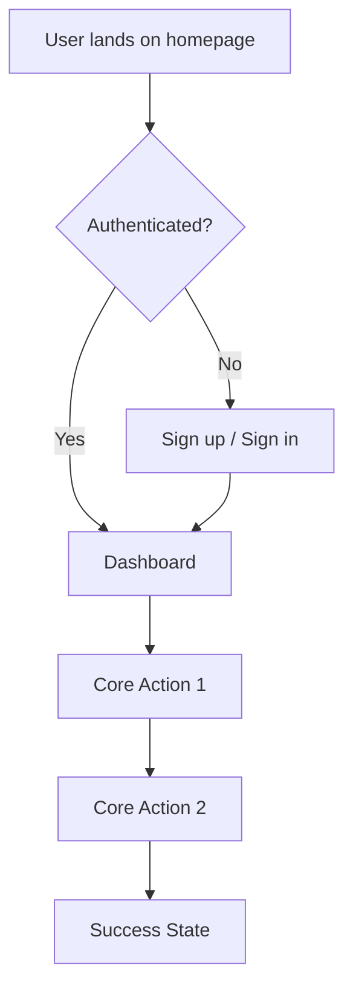

# Product Requirements Document (PRD)

> **Instructions**: Fill out each section below. Delete these instruction blocks when done.

## 1. Overview

### Product Name
[Your app name]

### One-Line Description
[A single sentence describing what this app does]

### Problem Statement
> What problem does this solve? Who has this problem? Why does it matter?

[Describe the problem clearly]

### Target Users
> Who is this for? Be specific.

| User Type | Description | Pain Points |
|-----------|-------------|-------------|
| [Primary User] | [Who they are] | [Their problems] |
| [Secondary User] | [Who they are] | [Their problems] |

---

## 2. Goals & Success Metrics

### Primary Goals (MVP)
> What must this app do to be considered successful?

1. [Goal 1]
2. [Goal 2]
3. [Goal 3]

### Success Metrics
> How will you measure success?

| Metric | Target | How to Measure |
|--------|--------|----------------|
| [Metric 1] | [Target value] | [Measurement method] |
| [Metric 2] | [Target value] | [Measurement method] |

### Non-Goals (Explicitly Out of Scope)
> What are you NOT building? This is just as important.

- [Not doing X]
- [Not doing Y]
- [Will consider Z in v2]

---

## 3. User Stories & Journeys

### Core User Stories (MVP)

#### US-1: [Story Title]
**As a** [user type]
**I want to** [action]
**So that** [benefit/outcome]

**Acceptance Criteria:**
- [ ] [Criteria 1]
- [ ] [Criteria 2]
- [ ] [Criteria 3]

---

#### US-2: [Story Title]
**As a** [user type]
**I want to** [action]
**So that** [benefit/outcome]

**Acceptance Criteria:**
- [ ] [Criteria 1]
- [ ] [Criteria 2]

---

### Primary User Journey

---

## 4. Features & Requirements

### MVP Features (Must Have)

#### Feature 1: [Feature Name]
**Description**: [What it does]
**Priority**: P0 (Critical)

| Requirement | Details |
|-------------|---------|
| User can... | [Specific capability] |
| System will... | [System behavior] |
| Data needed... | [What data is required] |

---

#### Feature 2: [Feature Name]
**Description**: [What it does]
**Priority**: P0 (Critical)

| Requirement | Details |
|-------------|---------|
| User can... | [Specific capability] |
| System will... | [System behavior] |

---

### Future Features (Nice to Have)

| Feature | Description | Priority | Target Version |
|---------|-------------|----------|----------------|
| [Feature A] | [Brief description] | P2 | v1.1 |
| [Feature B] | [Brief description] | P3 | v2.0 |

---

## 5. Design Requirements

### Brand & Style
> General look and feel

- **Style**: [Modern/Minimal/Bold/etc.]
- **Colors**: [Primary color, accent color]
- **Typography**: [Font family preference]
- **Inspiration**: [Links to similar products or designs you like]

### Key Screens

1. **Landing Page**
   - [What should be on it]
   - [Primary CTA]

2. **Dashboard**
   - [Key elements]
   - [Data displayed]

3. **[Other Key Screen]**
   - [Description]

### Responsive Requirements
- [ ] Desktop (primary)
- [ ] Tablet
- [ ] Mobile

---

## 6. Technical Constraints

### Stack (Pre-determined)
- Frontend: Next.js 14 + React
- Database: Convex
- Auth: Clerk
- Styling: Tailwind CSS
- Deployment: Vercel

### Integrations Required
| Service | Purpose | Priority |
|---------|---------|----------|
| [Service 1] | [Why needed] | Must have |
| [Service 2] | [Why needed] | Nice to have |

### Performance Requirements
- Page load: < 3 seconds
- Time to interactive: < 2 seconds
- [Other requirements]

---

## 7. Timeline & Milestones

### MVP Timeline

| Milestone | Target Date | Description |
|-----------|-------------|-------------|
| Project Setup | [Date] | Repo, auth, database configured |
| Core Feature 1 | [Date] | [Description] |
| Core Feature 2 | [Date] | [Description] |
| MVP Complete | [Date] | All P0 features working |
| Launch | [Date] | Public release |

---

## 8. Open Questions

> Things you're unsure about that need answers before or during development

1. [Question 1]?
2. [Question 2]?
3. [Question 3]?

---

## 9. Appendix

### Glossary
| Term | Definition |
|------|------------|
| [Term 1] | [Definition] |
| [Term 2] | [Definition] |

### References
- [Link to competitor/inspiration]
- [Link to relevant documentation]
- [Link to design mockups]

---

*Last Updated: [Date]*
*Version: 1.0*
