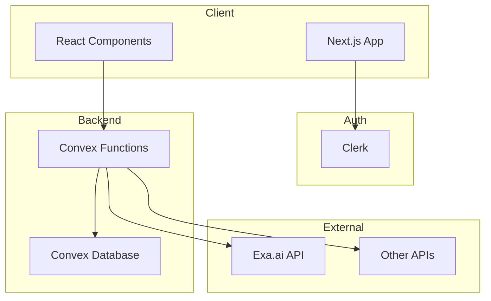
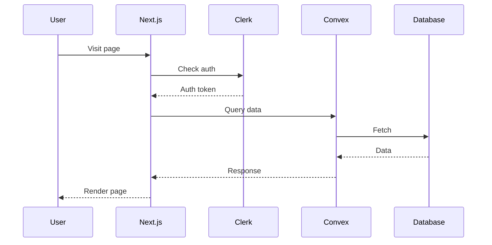
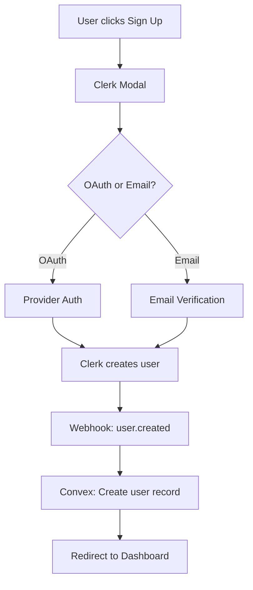

# Technical Design Document

> **Instructions**: This document translates the PRD into technical specifications. Fill out after the PRD is complete.

## 1. Overview

### Summary
[Brief technical summary of what we're building]

### Related Documents
- PRD: `docs/PRD.md`
- Architecture: `docs/ARCHITECTURE.mermaid`

### Tech Stack
| Layer | Technology | Notes |
|-------|------------|-------|
| Frontend | Next.js 14 (App Router) | React with TypeScript |
| Styling | Tailwind CSS | + shadcn/ui components |
| Database | Convex | Real-time, serverless |
| Auth | Clerk | OAuth + email/password |
| Deployment | Vercel | Automatic from GitHub |
| AI Search | Exa.ai | Semantic search API |

---

## 2. Architecture

### System Diagram



### Request Flow



---

## 3. Database Schema

### Tables

#### users
| Field | Type | Description |
|-------|------|-------------|
| _id | Id<"users"> | Auto-generated |
| clerkId | string | Clerk user ID |
| email | string | User email |
| name | string | Display name |
| avatarUrl | string? | Profile image |
| createdAt | number | Timestamp |

**Indexes**: `by_clerk_id`, `by_email`

---

#### [table_name]
| Field | Type | Description |
|-------|------|-------------|
| _id | Id<"table_name"> | Auto-generated |
| [field] | [type] | [description] |
| userId | Id<"users"> | Owner reference |
| createdAt | number | Timestamp |

**Indexes**: `by_user`

---

### Schema Code

```typescript
// convex/schema.ts
import { defineSchema, defineTable } from "convex/server";
import { v } from "convex/values";

export default defineSchema({
  users: defineTable({
    clerkId: v.string(),
    email: v.string(),
    name: v.string(),
    avatarUrl: v.optional(v.string()),
    createdAt: v.number(),
  })
    .index("by_clerk_id", ["clerkId"])
    .index("by_email", ["email"]),
    
  // Add more tables here
});
```

---

## 4. API Design

### Convex Functions

#### Queries (Read Operations)

| Function | Arguments | Returns | Auth Required |
|----------|-----------|---------|---------------|
| `users.me` | none | User | Yes |
| `[table].list` | { limit?: number } | Item[] | Yes |
| `[table].get` | { id: Id } | Item | Yes |

#### Mutations (Write Operations)

| Function | Arguments | Returns | Auth Required |
|----------|-----------|---------|---------------|
| `[table].create` | { ...fields } | Id | Yes |
| `[table].update` | { id: Id, ...fields } | void | Yes |
| `[table].delete` | { id: Id } | void | Yes |

### External APIs

#### Exa.ai Integration
```typescript
// Usage pattern
const results = await exa.search({
  query: "search term",
  numResults: 10,
  useAutoprompt: true,
});
```

---

## 5. File Structure

```
project-root/
├── src/
│   ├── app/                      # Next.js App Router
│   │   ├── (auth)/               # Auth-related routes
│   │   │   ├── sign-in/
│   │   │   └── sign-up/
│   │   ├── (dashboard)/          # Protected routes
│   │   │   ├── layout.tsx
│   │   │   ├── page.tsx          # Dashboard home
│   │   │   └── [feature]/        # Feature routes
│   │   ├── api/                  # API routes (if needed)
│   │   ├── layout.tsx            # Root layout
│   │   └── page.tsx              # Landing page
│   │
│   ├── components/
│   │   ├── ui/                   # Base UI components
│   │   │   ├── button.tsx
│   │   │   ├── input.tsx
│   │   │   └── ...
│   │   ├── features/             # Feature components
│   │   │   └── [feature]/
│   │   └── layouts/              # Layout components
│   │       ├── header.tsx
│   │       └── sidebar.tsx
│   │
│   ├── lib/                      # Utilities
│   │   ├── utils.ts              # Helper functions
│   │   └── constants.ts          # App constants
│   │
│   ├── hooks/                    # Custom hooks
│   │   └── use-[hook].ts
│   │
│   └── types/                    # TypeScript types
│       └── index.ts
│
├── convex/                       # Convex backend
│   ├── _generated/               # Auto-generated
│   ├── schema.ts                 # Database schema
│   ├── users.ts                  # User functions
│   └── [feature].ts              # Feature functions
│
├── public/                       # Static assets
├── docs/                         # Documentation
└── [config files]
```

---

## 6. Authentication Flow

### Sign Up Flow


### Protected Route Pattern
```tsx
// app/(dashboard)/layout.tsx
import { auth } from "@clerk/nextjs";
import { redirect } from "next/navigation";

export default async function DashboardLayout({
  children,
}: {
  children: React.ReactNode;
}) {
  const { userId } = auth();
  
  if (!userId) {
    redirect("/sign-in");
  }
  
  return <>{children}</>;
}
```

---

## 7. Component Specifications

### [ComponentName]

**Purpose**: [What it does]

**Props**:
| Prop | Type | Required | Default | Description |
|------|------|----------|---------|-------------|
| [prop] | [type] | [yes/no] | [value] | [description] |

**State**:
| State | Type | Description |
|-------|------|-------------|
| [state] | [type] | [description] |

**Events**:
- `on[Event]`: [When it fires]

---

## 8. Security Considerations

### Authentication
- [ ] All database mutations check `ctx.auth.getUserIdentity()`
- [ ] Protected routes use Clerk middleware
- [ ] API routes validate auth tokens

### Data Access
- [ ] Users can only access their own data
- [ ] Ownership verified before update/delete operations
- [ ] No sensitive data exposed in client queries

### Environment Variables
- [ ] All secrets in `.env.local` (not committed)
- [ ] Vercel environment variables configured
- [ ] No secrets in client-side code

---

## 9. Performance Considerations

### Caching Strategy
- Static pages: ISR with revalidation
- Dynamic data: Convex real-time subscriptions
- Assets: Vercel Edge caching

### Optimization Checklist
- [ ] Images use `next/image`
- [ ] Code splitting with dynamic imports
- [ ] Convex queries use proper indexes
- [ ] Client components minimized

---

## 10. Implementation Plan

### Phase 1: Setup (Day 1-2)
- [ ] Initialize Next.js project
- [ ] Configure Convex
- [ ] Set up Clerk authentication
- [ ] Create base layout and navigation

### Phase 2: Core Features (Day 3-X)
- [ ] Implement user management
- [ ] Build [Feature 1]
- [ ] Build [Feature 2]

### Phase 3: Polish (Day X-Y)
- [ ] Error handling
- [ ] Loading states
- [ ] Responsive design
- [ ] Performance optimization

### Phase 4: Launch (Day Y-Z)
- [ ] Testing
- [ ] Deploy to Vercel
- [ ] Monitor and iterate

---

## 11. Open Technical Questions

1. [Technical question 1]?
2. [Technical question 2]?

---

*Last Updated: [Date]*
*Version: 1.0*
